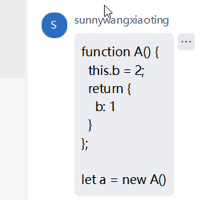

# 2025.3.14 滴滴一面

# 面经

<u>数据类型</u>

<u>怎么判断数据类型(typeof 和 instanceof区别)</u>

手写深拷贝

<u>deepclone 的 weakmap 弱引用，为什么用 weakmap，解释什么是弱引用，怎么垃圾清理，具体说说怎么解决循环依赖的(写深拷贝的测试用例)</u>

<u>let var const</u>

<u>说说 this 指向</u>

<u>箭头函数 this 指向</u>

<u>原型链</u>

<u>闭包(要说私有变量实现)</u>

<u>结合 usestate 说说闭包</u>

手写简易 usestate

写 usestate 的并行处理(应该指的批处理)

<u>生命周期(useeffect 怎么实现) return 什么时候执行，依赖数组变化了 return 执行吗</u>

<u>假如点击后 setState(比如点击下一页)，在 useEffect 里面发请求还是在 onclick 发请求</u>

<u>ref 传递，为什么要用 forwardref，能不能直接传 ref</u>

<u>受控组件和非受控组件</u>

手写 new

let a=new A()

<u>说说事件循环</u>

为什么区分宏微任务

<u>js 原生事件和 react 事件区别</u>

webpack 做过哪些配置

vite 和 webpack 区别

webpack 的代码分割，说到了路由懒加载实现

webpack 的 loader 和插件

tree-shaking 原理

说说对 promise 理解

<u>any 和 race 区别</u>

<u>手写 all 方法</u>

<u>all 方法 i 的问题</u>

‍

> ！教训：所有手写题都自己写一遍测试用例

---


```javascript
var a = 0;

const obj = {
  a: function() {
    var a = 1;
    
    const b = () => {
      console.log(this.a);
    };
    
    b();
  }
};

obj.a(); // 输出什么？
```

- 控制台会输出 `function(){...}`​（即 `obj.a`​ 的函数体）



‍

这里她撤回了一个，应该是想这样问

---

### 第一个例子：输出 `2`​ 的原因

```javascript
function A() {
  this.b = 2;
  return function() {
    console.log(this.c); // 注意这里访问的是 this.c
  };
}

const a = new A(); // a 是返回的函数
a.call({ c: 2 }); // 输出 2
```

**关键点**：

1. **构造函数** **​`A`​**​ **返回一个函数**：
   • `new A()`​ 会返回内部定义的函数：`function() { console.log(this.c); }`​。
   • 因此，`a`​ 是这个函数。
2. **调用** **​`a.call({ c: 2 })`​** ​：
   • `call`​ 方法会将函数内部的 `this`​ 指向参数对象 `{ c: 2 }`​。
   • 函数内部访问的是 `this.c`​，而 `{ c: 2 }`​ 有属性 `c`​，所以输出 `2`​。

---

### 第二个例子：输出 `20`​ 的原因

```javascript
function A() {
  this.b = 2;
  return function() {
    console.log(this.b); // 这里访问的是 this.b
  };
}

const a = new A();
a.call({ b: 20 }); // 输出 20
```

**关键点**：

1. **构造函数** **​`A`​**​ **仍然返回一个函数**：
   • `a`​ 是返回的函数：`function() { console.log(this.b); }`​。
2. **调用** **​`a.call({ b: 20 })`​** ​：
   • `call`​ 方法将函数内部的 `this`​ 指向 `{ b: 20 }`​。
   • 函数内部访问的是 `this.b`​，而 `{ b: 20 }`​ 有属性 `b`​，所以输出 `20`​。

---

### 为什么与原构造函数中的 `this.b = 2`​ 无关？

• **构造函数中的** **​`this.b = 2`​**​：
  • 这个 `this`​ 是构造函数 `A`​ 执行时的实例（如果构造函数没有返回对象，`new A()`​ 的实例会包含 `b: 2`​）。
  • 但你的构造函数返回了一个函数，导致 `new A()`​ 的实例被丢弃，最终结果是一个函数。

• **返回的函数与原构造函数无关**：
  • 返回的函数是一个独立的函数，它的 `this`​ 由调用方式决定（如 `call`​、直接调用等）。
  • 函数内部访问的 `this.b`​ 或 `this.c`​ 完全取决于调用时传入的 `this`​ 对象。

---

### 总结

• **​`call`​**​ **的作用**：显式指定函数内部的 `this`​ 值。
• **输出结果由以下两点决定**：

1. **函数内部访问的属性**（如 `this.c`​ 或 `this.b`​）。
2. **调用时传入的** **​`this`​**​ **对象**（如 `{ c: 2 }`​ 或 `{ b: 20 }`​）。

因此：
• 第一个例子中，`this.c`​ 对应 `{ c: 2 }`​，输出 `2`​。
• 第二个例子中，`this.b`​ 对应 `{ b: 20 }`​，输出 `20`​。

​​
