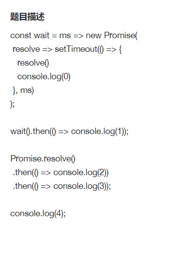

# 2025.3.18字节一面

- 
- 
- ```javascript
  let a = function () {
    return {
      m: function () {
        console.log(this); // 普通函数
      },
      n: () => {
        console.log(this); // 箭头函数
      }
    };
  };

  let b = {};
  let c = a.call(b);  // 使用 b 作为 this 调用 a
  c.m(); // 调用 m 方法
  c.n(); // 调用 n 方法
  ```
- 如果是let c=a()呢
- 
- ```javascript
  const wait = (ms) => new Promise( resolve => 
    setTimeout(() => { 
      resolve();
      console.log(0);
    }, ms)
  );

  wait(0).then(() => console.log(1)); 
  Promise.resolve()
    .then(() => console.log(2)) 
    .then(() => console.log(3)); 
  console.log(4);
  ```
- > ### 执行步骤分析：
  >
  > 1. **同步代码执行**：
  >
  >     ```javascript
  >     wait(0).then(...)    // 1. 初始化wait(0) Promise
  >     Promise.resolve()... // 2. 创建已解决的Promise链
  >     console.log(4)       // 3. 同步输出
  >     ```
  >     **输出：**​**​`4`​**​
  > 2. **微任务队列创建**：
  >
  >     - ​`Promise.resolve()`​ 会立即将第一个 `.then(()=>console.log(2))`​ 加入微任务队列
  >     - 微任务队列当前：`[微任务1: console.log(2)]`​
  > 3. **宏任务创建**：
  >
  >     - ​`wait(0)`​ 中的 `setTimeout`​ 被注册（延迟0ms）
  >     - 宏任务队列：`[宏任务1: wait的setTimeout回调]`​
  > 4. **事件循环处理**：
  >
  >     - **执行微任务队列**：
  >
  >       - 执行微任务1：`console.log(2)`​  
  >         **输出：**​**​`2`​**​
  >       - ​`.then(()=>console.log(2))`​ 完成后，将下一个 `.then(()=>console.log(3))`​ 加入微任务队列
  >       - 执行新增微任务：`console.log(3)`​  
  >         **输出：**​**​`3`​**​
  >     - 微任务队列清空
  > 5. **执行宏任务队列**：
  >
  >     - 执行宏任务1（wait中的setTimeout回调）：
  >
  >       ```javascript
  >       resolve();      // 完成wait(0)的Promise
  >       console.log(0); // 同步输出
  >       ```
  >       **输出：**​**​`0`​**​
  >     - ​`resolve()`​ 将 `.then(()=>console.log(1))`​ 加入微任务队列
  > 6. **再次处理微任务队列**：
  >
  >     - 执行新增微任务：`()=>console.log(1)`​  
  >       **输出：**​**​`1`​**​
  >
  > ### 最终输出顺序：
  >
  > ```markdown
  > 4 → 2 → 3 → 0 → 1
  > ```
  >
- 为什么0可以被输出
- 答案 42301
- 算法题：不同路径
- usestate更新机制
- fiber架构
- diff算法
