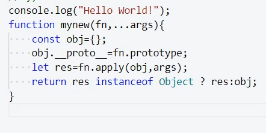
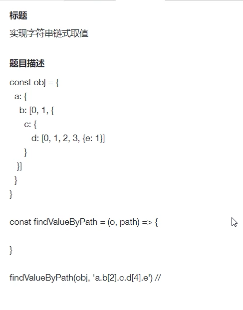
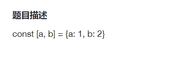

# 一战字节二面

- esm和cjs的区别
- 哪一种可以tree shaking
- script标签中async和differ区别
- 闭包
- 比如说在我们实际这个开发过程当中，如果说不得不使用一些B包的情况下，那有哪些方法可以去避免所谓的它带来一些内存泄露的隐患呢？
- 装饰器语法
- 手写new

  - 当时写的

    - 
  - instanceof哪些类型会被识别为object
  - 那如果它本身function也是会命中你这个判断的话，那你把直接把这个functions返回来，这个是合理的吗？
- ts的联合和交叉类型的区别
- 两种类型一般会在什么场景下使用
- interface/type对同一个接口定义了两次，会合并还是覆盖
- 重排重绘
- 如果说我们在实际开发当中，有些时候不就不得不去做一些重复或者重排的操作的时候，有哪些方式可以去避免？就去尽量的去避免他所谓的所谓的带来的一些性能上的问题。
- transform能够避免的原因
- css的预处理器和后处理器区别
- cookie常见属性和作用
- cookie这个东西我们一般是做什么的
- 然后你刚刚说他一般其实可能cookie这个东西会用于所谓的做一些身份认证的信息的携带对吧？然后我这边的问题是说，除了cookie能做到之外，有有其他的方式能在在所谓的做这个身份证认证信息的携带的这个载体。
- 有了解过直接放在head里面吗？
- http1.0和2.0差异
- 然后你刚刚说的那个所谓的服务器推推推送是吧，这个在实际的项目当中，一般来说是怎么去用它呢？或者说在什么场景下可以尝试去用。
- 1.0跟1.1的一些差异有了解过。
- ‍
- 手写lodash的get方法

  - 
- 

  - 怎么让这个代码跑起来不报错
  - 迭代器
