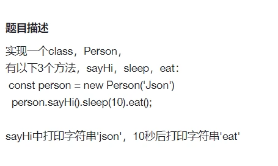

# 懂车帝一面

- 手写一个简单的排序
- js的函数入参，传递的是指针还是什么
- 如果是传递了一个object，那入参是什么
- js函数的生命过程
- 那么函数声明的时候，参数又是怎么被声明，或者说是放在什么地方的呢？
- function mysort(myarray)，这个myarray在声明的时候，他一有没有被声明？二如果有，是在哪里？如果没有，那他什么时候出来的呢？就他什么时候或者说这个myarray他什么时候有用。
- 
- 链式调用的基本原理是什么。
- js的基本和复杂类型
- js它区分这两种数据类型的原因是什么呢？或者说这两种数据类型有什么本质的区别吗？
- js基础数据类型里面，有没有几个数据类型不是存在栈中的
- string存在什么地方（从大s的string和小s的string说）
- 小string存在栈上大小是一定的吗（这里结合string不可变说）
- 小string大小是一定的吗
- 我举个简单的例子，你现在这个栈被初始化出来的时候，比如说它一共有1B那么大对吧？我现在声明了一个小string，这个string的长度是有限的还是无限的？
- 有如果他有限的话，那那这个长度是多少呢
- js的同步异步和单线程实现循环这一套流程有了解过吗？
- 事件循环是js本身的特性，还是js运行环境所提供的一个特性。
- 那在浏览器里面，浏览器是怎样实现循环的，有了解过吗？
- 浏览器的渲染这件事情是在事件循环中还是不在事件循环中？
- 那也就是说js运行在事件循环中？浏览器的渲染不在事件渲染中对吧？也就意味着说浏览器的渲染不会被自然阻塞，可以这么理解吗？
- 浏览器渲染肯定会被阻塞。那他是怎样一个机制呢？除了不在就是他不在事件循环中，它是通过一种怎样的其他机制来导致事件循环中的js运行会阻塞浏览器的渲染。
- 箭头函数和普通函数有什么区别
- 箭头函数不能new，为什么
- 关于new这件事，我当我写了一个class a等于new b的时候，那这个new b写出来的时候，它的流程是什么呢？
- 上面说到了异步，那promise有用的多吗？
- 有了解过pro mise的错误处理是怎么做的，或者我这么问，如果我在try tech上运行了一个promise，那这个promise里的错误可以被捕获到吗？
- 换一个问法，我现在想捕获promise错误该怎么写呢？
- 在promise外面try catch能不能捕获promise的错误
- 为什么外面不行？
- 原型链
- react中使用过error-boundary吗
- 另外一个场景是在react里面，比如说我想在我想监听一个dom当这个dom变化的时候，然后要去触发一个函数或者做某一些事情。那你觉得这样一个场景我该怎么实现呢？
- 就是我想在某一个dom发生变化的时候，比如说这个dom刚被挂载出来的时候，然后我就去触发某一个事情。比如说获取这个dom的实例，然后关于他的闭包这种事儿。
- 我的诉求是当这个dom被挂载出来的时候，给我一个事件通知，就是我手动去跳，useRef，ref.current是可以获取它的，没有问题。我想想问的是这一行我获取它的代码应该写在什么地方？
- 问：是指某个dom出现在当前视口吗。它也可以是，因为挂载的含义，它其实并不是出现在视口。比如说这个dom就是当一个拿原生JS来说，当一个dom从display none变成display block的时候，它是被挂载的对吧？是，然后你说那个视口它有它不仅是我说的这个情况，还有一种是它其实已经display block了。但是它不在当前浏览器内，它被滚动，比如scroll滚动下去了，就是说把它滚上来，它其实也是一个从非视口到视口这么一个过程。
- 如果用原生的js去实现这样一个监听dom被划进视图的这么一件事情的话，你觉得该怎么做会好一点呢？抛开react，用原生的js和原生的dom结构去实现这个东西，你觉得怎样做会好一点？
- 难以描述的问题（https://tingwu.aliyun.com/doc/transcripts/yg7k9w6do7y5nxwd  56:13）
- 简单描述下usestate和usecallback
- ‍
