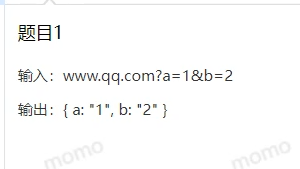
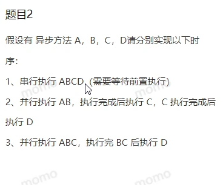
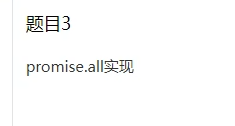

# 腾讯cdg一面

- 
- 
- 
- axios拦截器
- 拦截器它是怎么实现的？就他他原理是怎么样的？
- get static propos和get serversidepropos这两个区别是什么
- TCP建立链接的话，它是都知道有三次握手，对吧？为什么关闭的时候我们会是需要四次挥手呢？
- 有更多的数据，比方说它一共有上万条数据，然后还有什么优化的工作会做吗？（答虚拟列表）
